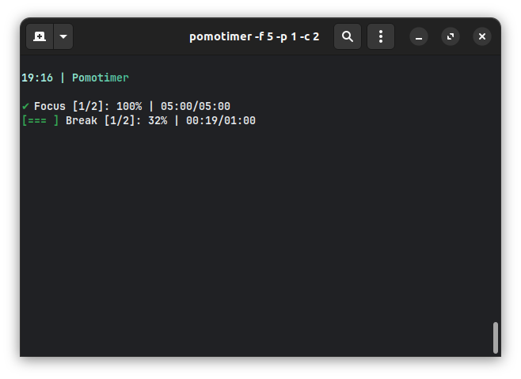
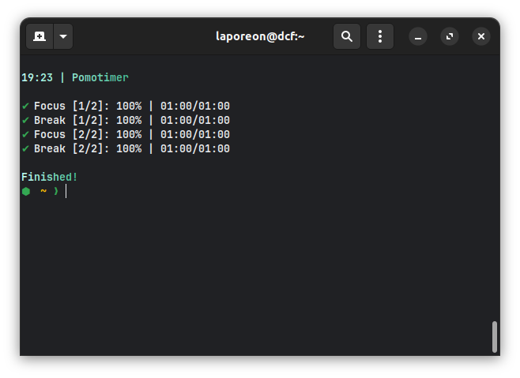
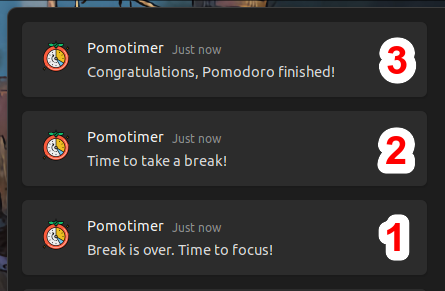

<h1 align="center">
	
  <p> Pomotimer</p>
</h1>

> A simple Pomodoro CLI timer.

## Table of Contents

- [Features](#Features)
- [Requirements](#Requirements)
- [Installing](#installing)
- [Usage](#usage)
- [Preview](#preview)
  - [Running](#running)
  - [Finished](#finished)
  - [Notifications](#notifications)
    <br/>

---

## Features

- ✔️ Customize your focus time session.
- ✔️ Customize your break time session.
- ✔️ Customize how many cycles you want to do.
- ✔️ Customize your Pomodoro title.
- ✔️ Toast notifications at the end of focus, break and pomodoro completed stages. Not avaialkable for WSL.
- ⚠️ Custom sounds notifications: at this time, custom sounds are only being played ate Unix systems. On Windows and MacOS sound willl be system default.

## Requirements

- [NodeJS](https://nodejs.org/en) v.20 or higher

If you use [NVM](https://github.com/nvm-sh/nvm), just run `nvm use` inside of the root folder.

## Installing

After cloning this repository, run the following command inside the root folder to install the project globally and allow you to use the commands at any directory you are, even if it's not the project's folder.

```bash
$ npm install -g .
```

Now you're good to go.

## Usage

```text
Usage: pomotimer [options]

A Pomodoro CLI timer.

Options:
  -V, --version              output the version number
  -f, --focus <value>        Focus time in minutes (default: "25")
  -p, --pause <value>        Break time in minutes (default: "5")
  -c, --cycles <value>       How many cycles you want do do (default: "4")
  -t, --title <value>        Customize Pomodoro title. (default: "Pomotimer")
  -h, --help                 display help for command

Examples:
  pomotimer -t "Studying JavaScript"
  pomotimer -s "summer"
  pomotimer -f 15 -p 5 -c 2
  pomotimer -f 5 -t "Reading"
```

## Preview

### Running:



### Finished:



### Notifications



Notifications meaning:

- #1 at the end of each break session
- #2 at the end of each focus session
- #3 at Pomodoro completion

[⬆ Back to the top](#---pomotimer)
