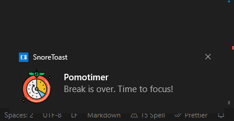
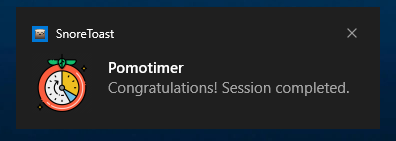

<h1 align="center">
	
  <p> Pomotimer</p>
</h1>

> A simple Pomodoro CLI timer.

## Table of Contents

- [Features](#Features)
- [Requirements](#Requirements)
- [Installing](#installing)
- [Usage](#usage)
- [Preview](#preview)
  - [Running](#running)
  - [Notifications](#notifications)
    <br/>

---

## Features

- Customize your focus time session.
- Customize your break time session.
- Customize how many cycles you want to do.
- Customize your Pomodoro title.
- Get a system notification at the end of each session. [Not available for WSL and MacOS]
- Customize notification description for finished cycles.
- Customize style for Pomodoro texts.

## Requirements

- [NodeJS](https://nodejs.org/en) v.20 or higher

If you use [NVM](https://github.com/nvm-sh/nvm), just run `nvm use` inside of the root folder.

## Installing

After cloning this repository, run the following command inside the root folder to install the project globally and allow you to use the commands at any directory you are, even if it's not the project's folder.

```bash
$ npm install -g .
```

Now you're good to go.

## Usage

```text
Usage: pomotimer [options]

A Pomodoro CLI timer.

Options:
  -V, --version              output the version number
  -f, --focus <value>        Focus time in minutes (default: "25")
  -p, --pause <value>        Break time in minutes (default: "5")
  -c, --cycles <value>       How many cycles you want do do (default: "4")
  -t, --title <value>        Customize Pomodoro title. (default: "Pomotimer")
  -d, --description <value>  Customize notification description. (default: "Congratulations! Session completed.")
  -s, --style <value>        Customize CLI text color. (default: "morning")
  -h, --help                 display help for command

Examples:
  pomotimer -t "Studying JavaScript"
  pomotimer -s "summer"
  pomotimer -f 15 -p 5 -c 2
  pomotimer -f 5 -t "Reading" -d "Finished" -s "rainbow"
```

## Preview

### Running:


### Notifications

**At the end of each focus session**:


**At the end of each break session**:



**At Pomodoro full cycle completion**:



[⬆ Back to the top](#---pomotimer)
